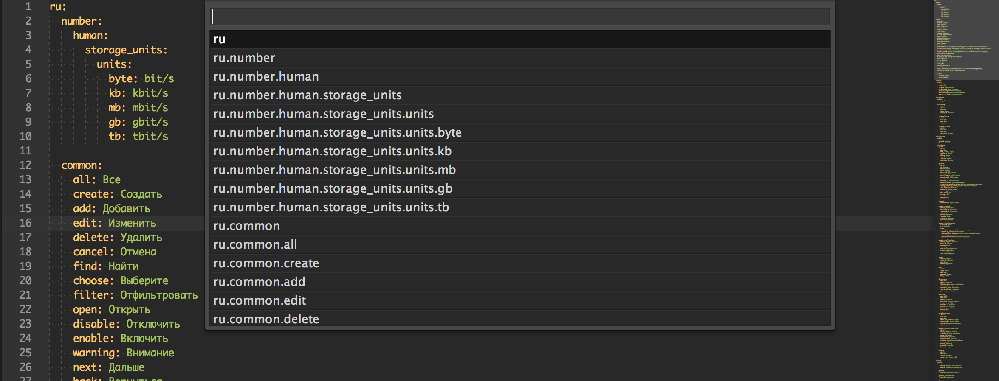

# YAML Nav

Sublime Text 3 plugin for quick navigation in YAML files.



## Installation

### With Package Control

See http://wbond.net/sublime_packages/package_control/installation for instructions.

Open the palette (Control+Shift+P or Command+Shift+P) in Sublime Text and select Package Control: Install Package and then select "YAML Nav" from the list.

### Manually

 * cd <YOUR PACKAGES DIRECTORY> (eg. ~/Library/Application\ Support/Sublime\ Text\ 3/Packages)
 * git clone http://github.com/ddiachkov/sublime-yaml-nav

## Key bindings

Command+R (Control+R) in YAML source will run "goto_yaml_symbol" command.

Command+Shift+W (Control+Shift+W) in YAML source will run "copy_yaml_symbol_to_clipboard" command.

## Localization YAML's

Since version 1.2.0 YAML Nav tries to detect YAML's with localization data (ie. Rails locales) and automatically strips first tag when symbol is copied to the clipboard (Command+Shift+W). For example "en.active_record.attributes.entity.name" will be copied as "active_record.attributes.entity.name".

This behavior can be disabled by setting ```"trim_language_tag_on_copy_from_locales": false``` in configuration file ("YAML Nav.sublime-settings").

## Licence

All of YAML Nav is licensed under the MIT licence.

  Copyright (c) 2013-2014 Denis Diachkov

  Permission is hereby granted, free of charge, to any person obtaining a copy
  of this software and associated documentation files (the "Software"), to deal
  in the Software without restriction, including without limitation the rights
  to use, copy, modify, merge, publish, distribute, sublicense, and/or sell
  copies of the Software, and to permit persons to whom the Software is
  furnished to do so, subject to the following conditions:

  The above copyright notice and this permission notice shall be included in
  all copies or substantial portions of the Software.

  THE SOFTWARE IS PROVIDED "AS IS", WITHOUT WARRANTY OF ANY KIND, EXPRESS OR
  IMPLIED, INCLUDING BUT NOT LIMITED TO THE WARRANTIES OF MERCHANTABILITY,
  FITNESS FOR A PARTICULAR PURPOSE AND NONINFRINGEMENT. IN NO EVENT SHALL THE
  AUTHORS OR COPYRIGHT HOLDERS BE LIABLE FOR ANY CLAIM, DAMAGES OR OTHER
  LIABILITY, WHETHER IN AN ACTION OF CONTRACT, TORT OR OTHERWISE, ARISING FROM,
  OUT OF OR IN CONNECTION WITH THE SOFTWARE OR THE USE OR OTHER DEALINGS IN
  THE SOFTWARE.
